# Siga 

## Menu Matrícula

    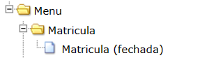
    
<i>Imagem: Menu matrícula Siga</i>

### Heurística 1 - Visibilidade do sistema

Aqui não há clareza sobre o status da matrícula, pois ele não diz o que seria esse "fechada" (seria que a pessoa trancou o curso? ou poderia significar outra coisa? e ao clicar nesse link nada acontece).

### Heurística 4 - Consistência e Padrões

Como dito anteriormente a palavra "fechada" pode significar mais de uma coisa, podendo deixar assim, o usuário confuso.

## Página Home

    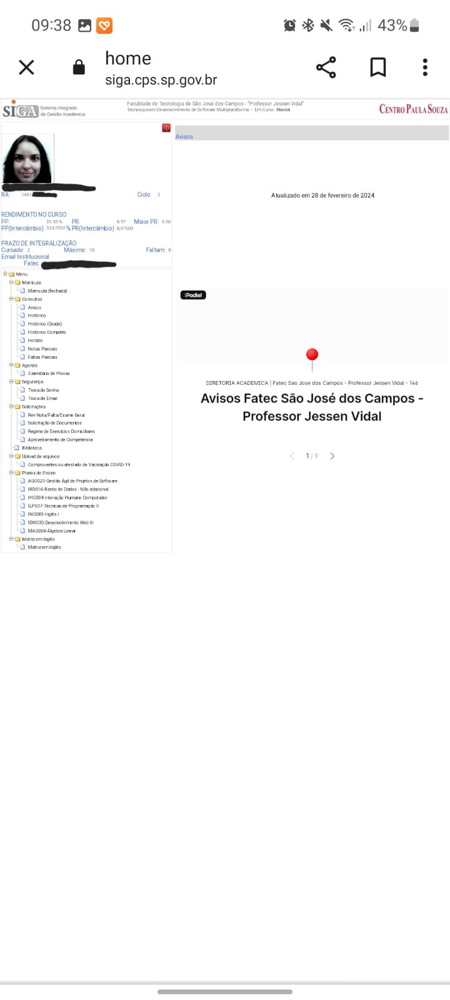
    
<i>Imagem: Página Home Siga</i>

### Heurística 2 - Correspondência entre o sistema e o mundo real

Logo no início da página no lado esquerdo abaixo da foto em "Rendimento no curso" não está especificado o que exatamente são aquelas abreviações (PP, PR, etc.). Portanto, para aqueles não estão acostumados a este ambiente acadêmico ou não possuem o conhecimento do que são estas coisas podem ficar confusos.

### Heurística 8 - Design estético e Minimalista

A página Home do Siga está repleto de informações raramente necessárias para os alunos da FATEC SJC, além de <i>sempre</i> ao entrar no site as pastinhas do lado esquerdo já virem todas abertas independeente se o que está aberto será mais útil ou não

Também fere esta heurística devido à responsividade que é inexistente independente de onde você o acessa.

### Heurística 10 - Ajuda e Documentação

Não há em nenhum lugar uma documentação que ajude a entender o sistema, o que pode causar desentendimentos como aquele citado anteriormente na imagem de Matrícula. 

## Página Planos de Ensino 

    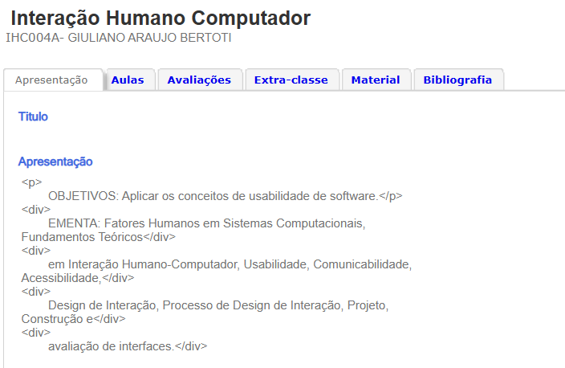
    
<i>Imagem: Página de planos de ensino do siga da disciplina Interação Humano x Computador</i>

### Heurística 2 - Correspondência entre o sistema e o mundo real

Aqui o design do site não fala a linguagem do usuário, quebrando assim a 2° heurística.
 

# IME Unicamp

    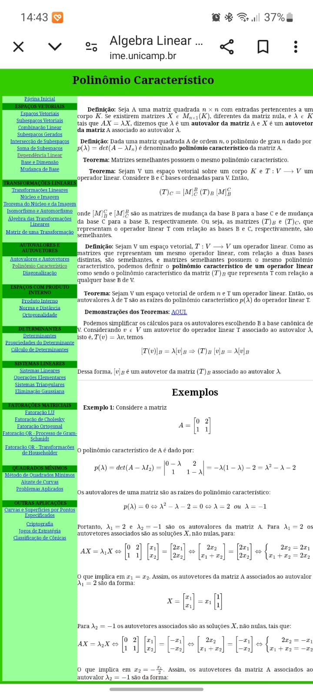
    
<i>Imagem: IME Unicamp - Polinômio Característico</i>

    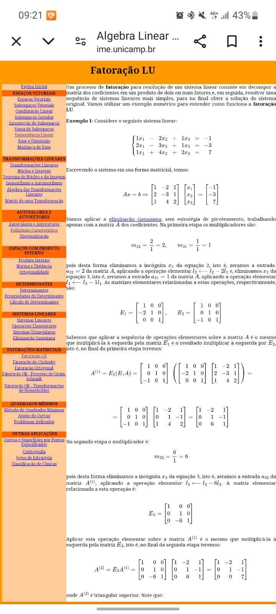
    
<i>Imagem: IME Unicamp - Fatoração LU</i>

### Heurística 4 - Consistência e padrões

Não há qualquer consistência ou padrão no site da IME Unicamp, pois cada página de um tema matemática possui uma cor diferente.

### Heurística 7 - Flexibilidade e Eficiência de Uso

Não há nenhuma personalização no site (nem mesmo uma coisa básica como um menu hambúrguer) embora esteja tudo de fácil acesso.

### Heurística 8 - Design Estético e Minimalista

A interface contém muitas informações e seu design está muito poluído dificultando a visibilidade do usuário.

# Quero Bolsa

    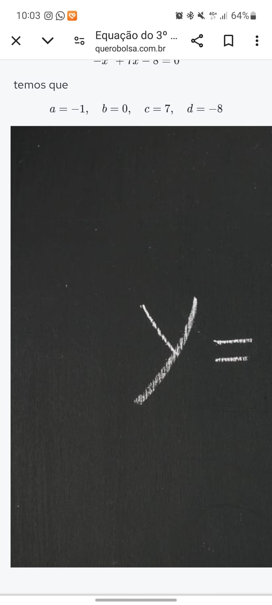
    
<i>Imagem: Quero Bolsa - Equação do 3° grau</i>

### Heurística 4 - Consistência e Padrões

Aqui não existe responsabilidade, ferindo assim a consistência e o padrão.

# UNIMED Cliente SJC

    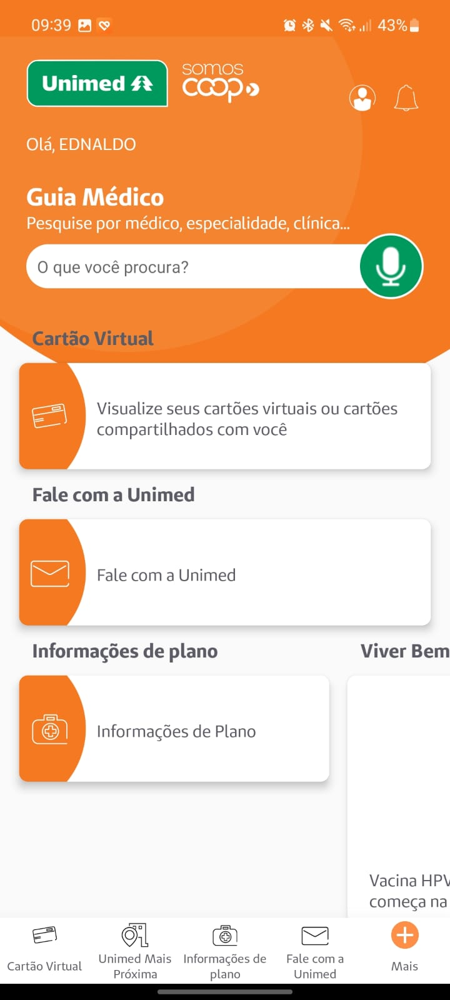
    
<i>Imagem: Home - App: UNIMED</i>

### Heurística 1 - Visibilidade do status do sistema

Aqui o usuário não consegue tere uma visualização clara do status do sistema nem dos feedbacks do sistema.

### Heurística 3 - Controle e Liberdade do Usuário

Não está em evidência a "saída de emergência". Para chegar até ela é necessário explorar um pouco mais, o que pode dificultar no caso de pessoas simples e de pouco entendimento tecnológico.

### Heurística 7 - Flexibilidade e Eficiência de Uso 

O aplicativo não é nada flexível embora seja eficiente. Ele não dá muitos caminhos de realizar uma determinada ação frequente.

    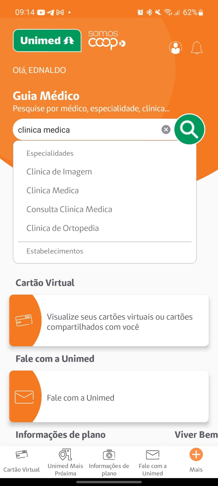
    
<i>Imagem: Busca dentro do app da Unimed</i>

### Heurística 4 - Consistência e Padrões

Aqui há um erro de consistência e padrão pois mesmo que eu pesquise algo nessa busca e encontre, ao clicar no item de minha escolha nada acontece, ele apenas fica listando as opções. Para realmente ir para onde quero (ex: se eu busquei Cliníca Médica, desejo ir para a listagem de clínicas médicas) é necessário clicar no icon de lupa da busca.

# IF - Sistema Linear

    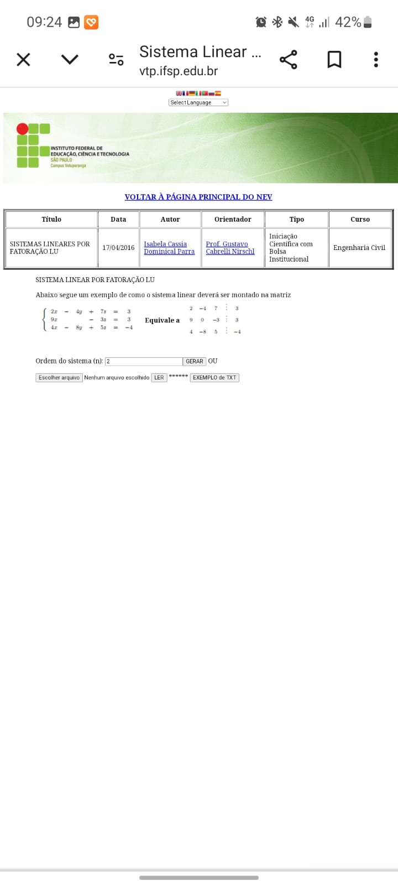
    
<i>Imagem: Página calculadora de sistemas lineares do IF</i>

### Heurística 8 - Design estético e minimalista

O site não possui qualquer responsividade, tornando dificil a visualização das informações quando acessado pelo celular.

# Embraer

    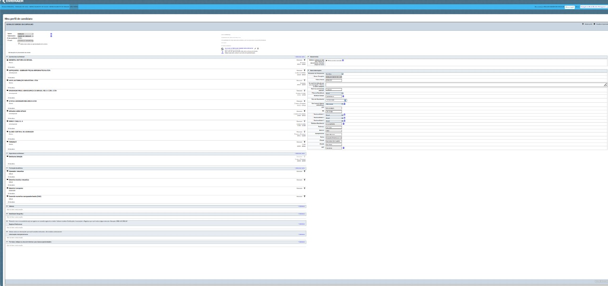
    
<i>Imagem: Formulário da embraer para vaga de emprego acessada pelo computador</i>

### Heurística 1 - Visibilidade do sistema

Aqui, devido o erro da heurística 8 (design estético e minimalista) não fica muito claro o que está acontecendo pois não é possível visualizar isso com clareza (ex: o que falta preencher no formulário, o que é obrigatório, etc).

### Heurística 8 - Design estético e minimalista

O site não possui qualquer responsividade, tornando difícil a visualização do que está ocorrendo.

## Alguns outros Sites com erros de Heurística 8

    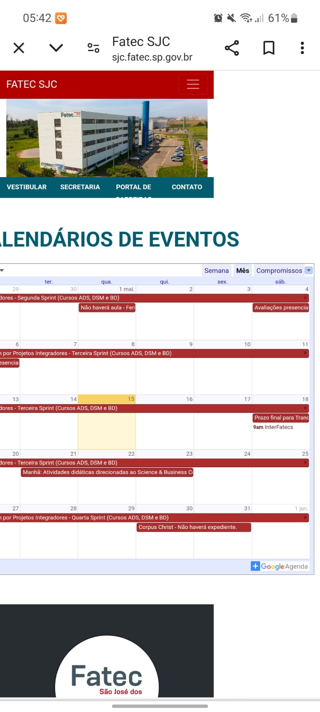
    
<i>Imagem: Site FATEC SJC acessado pelo celular para visualização do calendário</i>

    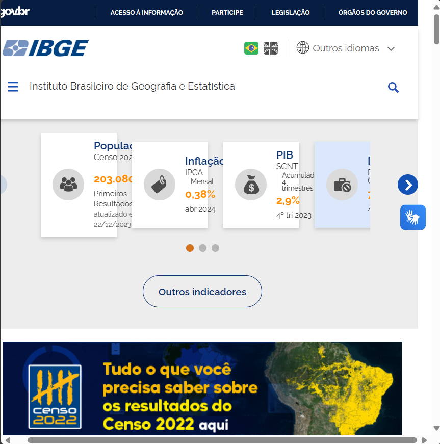
    
<i>Imagem: Site do IBGE (home)</i>

    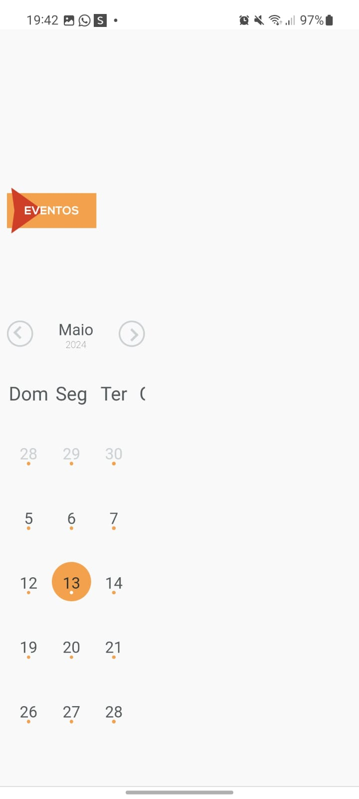
    
<i>Imagem: Site da Prefeitura de Pelotas acessado pelo celular</i>

    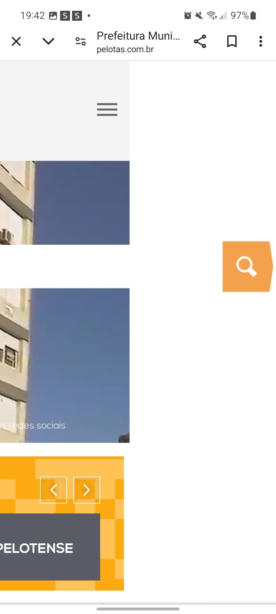
    
<i>Imagem: Site da Prefeitura de Pelotas acessado pelo celular</i>

    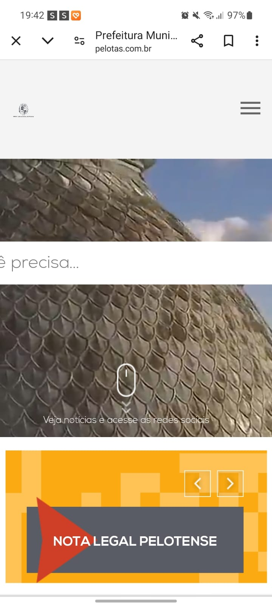
    
<i>Imagem: Site da Prefeitura de Pelotas acessado pelo celular</i>

